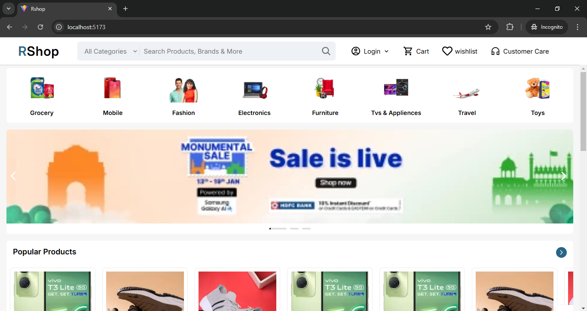
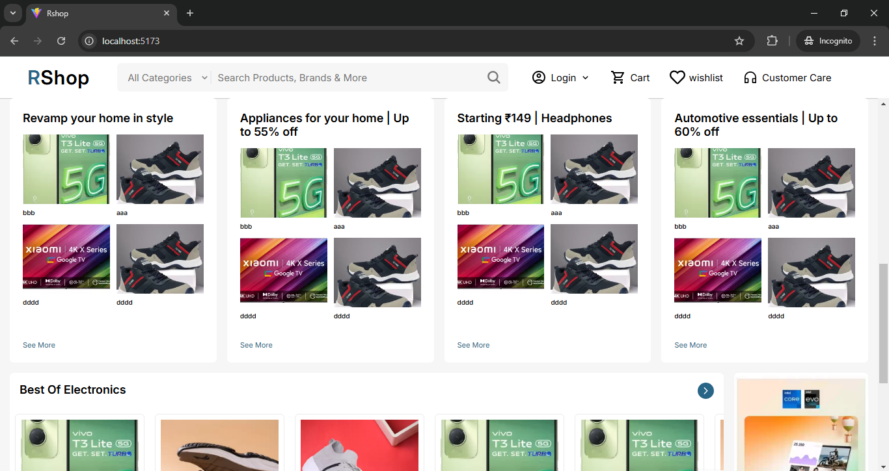
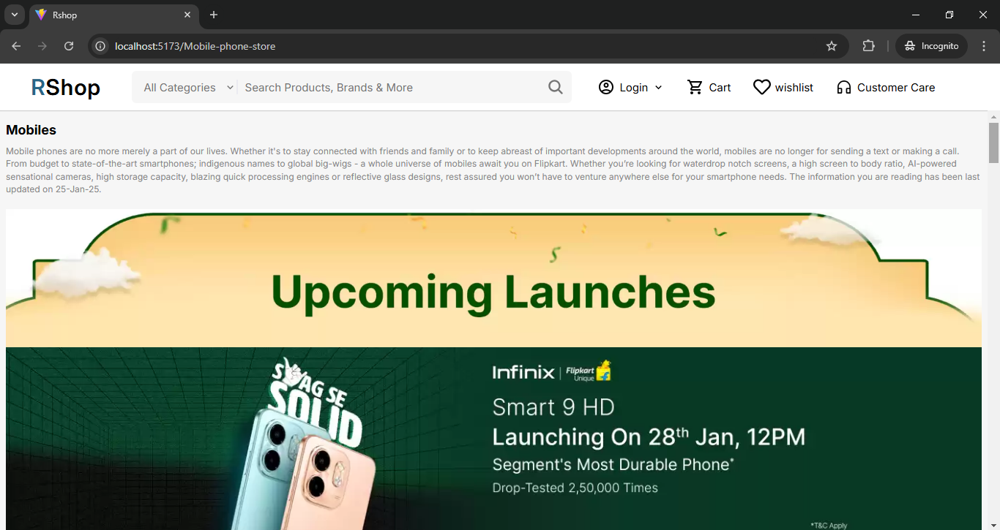
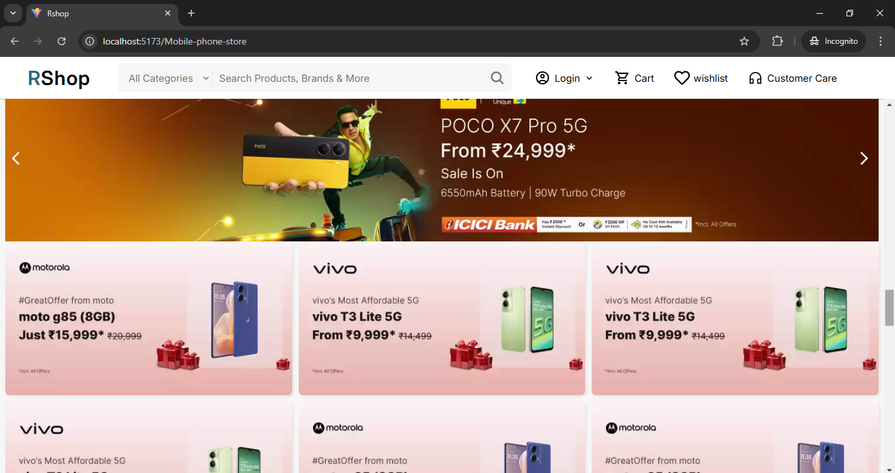
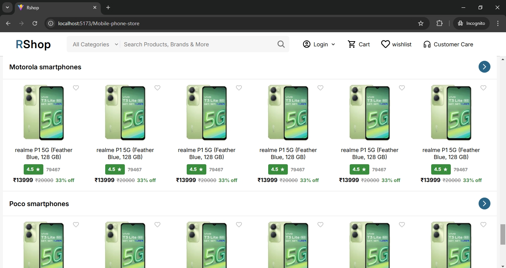
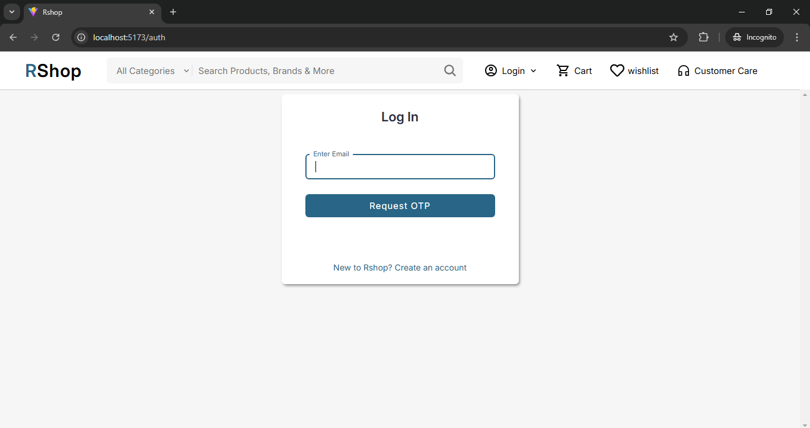
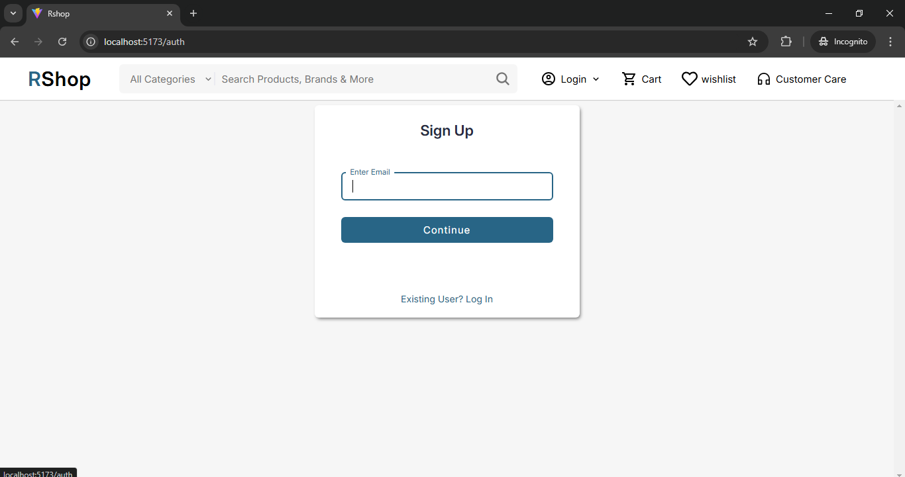
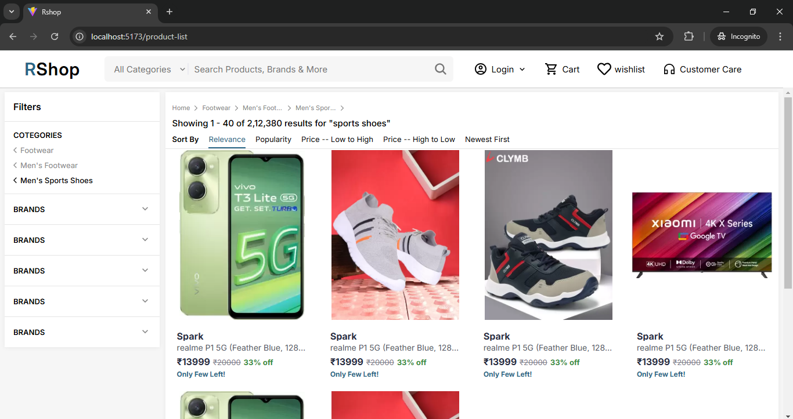

# E-Commerce Web Application 🛒

This is a e-commerce web application that provides a seamless user experience, secure authentication, and smooth state management. The application is built using React.js, Node.js, Express, and MySQL.

## Features 🌟

- **User Authentication**: Secure JWT-based authentication ensuring the protection of user data.
- **OTP-Based Email Verification**: Integrated OTP (One-Time Password) sent to the user's email for enhanced security during account creation.
- **State Management**: Implemented Redux Toolkit for efficient state management across the application.
- **Database**: Utilizes MySQL for storing data.
- **API Integration**: Developed RESTful APIs for smooth communication between the front-end and back-end.

## Tech Stack 💻

- **Frontend**: React.js
- **Backend**: Node.js, Express
- **Database**: MySQL
- **State Management**: Redux Toolkit
- **Authentication**: JWT (JSON Web Tokens)
- **Email Verification**: OTP-based, implemented using **Nodemailer**

## Project Screenshots 📸

<div style="display: flex; flex-wrap: wrap; gap: 20px; justify-content: space-between;">
  
  
  
  
  
  
  
  
</div>


## Setup Instructions 🛠️

To run the project locally, follow these steps:

### 1. Clone the repository

```bash
git clone https://github.com/rupeshpatil27/React-Ecommerce-Project.git
cd React-Ecommerce-Project
```

### 2. Install dependencies

For the backend:

```bash
cd server
npm install
```

For the frontend:

```bash
cd client/rshop
npm install
```

### 3. Backend `.env` Configuration

- **PORT**=port no
- **HOST**=localhost
- **USER**=username
- **NAME**=database name
- **PASS**=password

- **CORS_ORIGIN**=*

- **JWT_SECRET_KEY**={jwt-secret-key}
- **JWT_EXPIRE**=duration

- **ASSECC_TOKEN_SECRET**={assecc-token-secret-key}
- **ASSECC_TOKEN_EXPIRE**=duration
- **REFRESH_TOKEN_SECRET**={refresh-token-secret-key}
- **REFRESH_TOKEN_EXPIRE**=duration

- **COOKIE_EXPIRE**=duration


- **SMTP_HOST**=SMTP host
- **SMTP_SERVICE**=SMTP service
- **SMTP_PORT**=SMTP port
- **SMTP_MAIL**=email id
- **SMTP_PASSWORD**=email password

